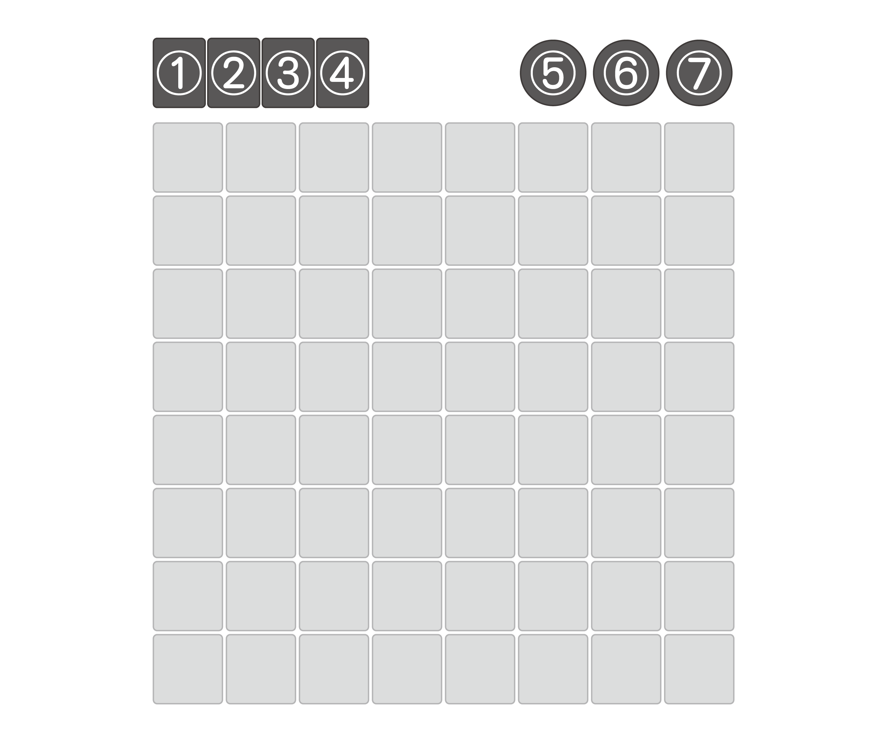
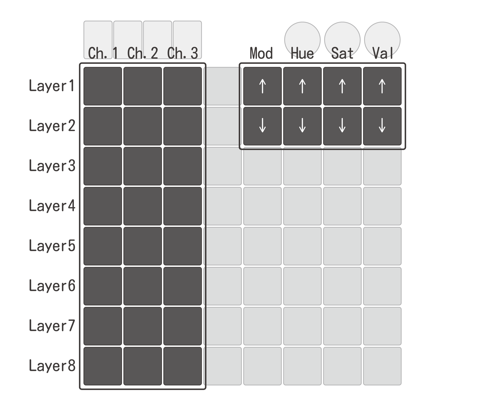
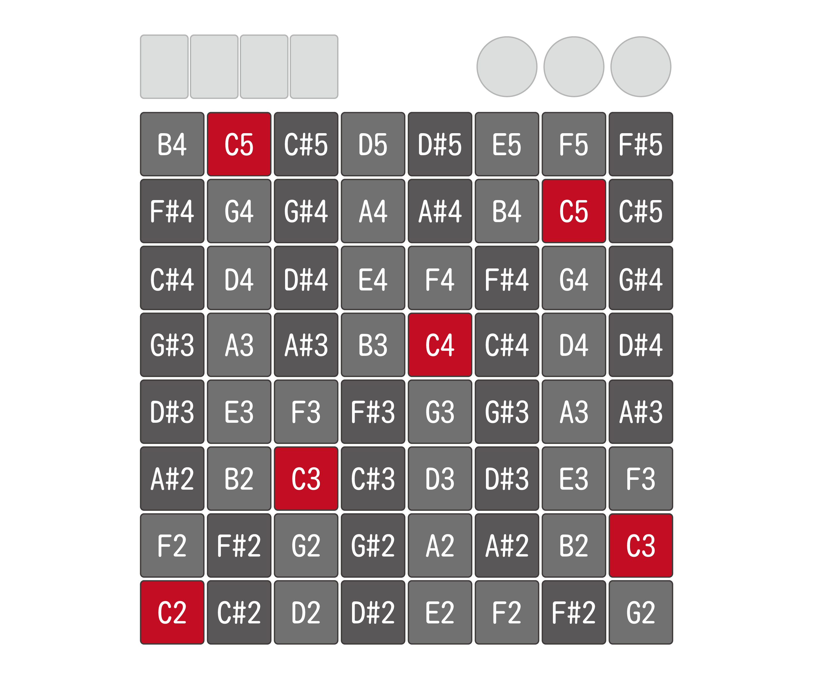
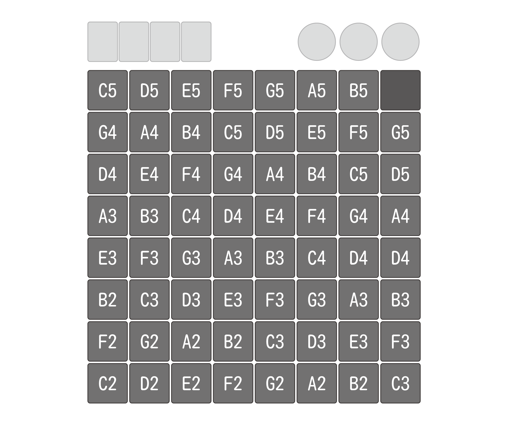
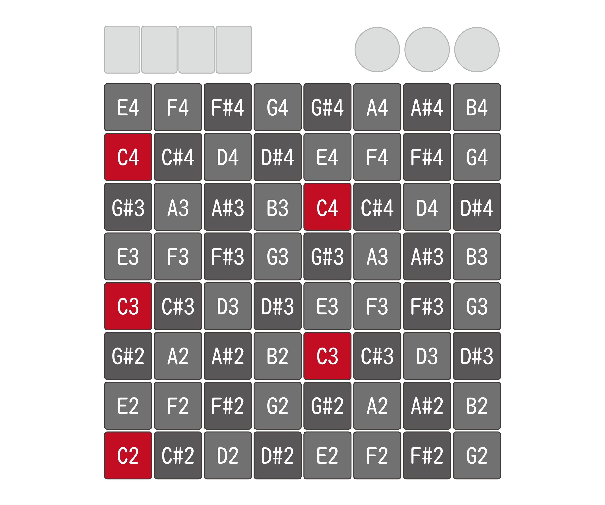
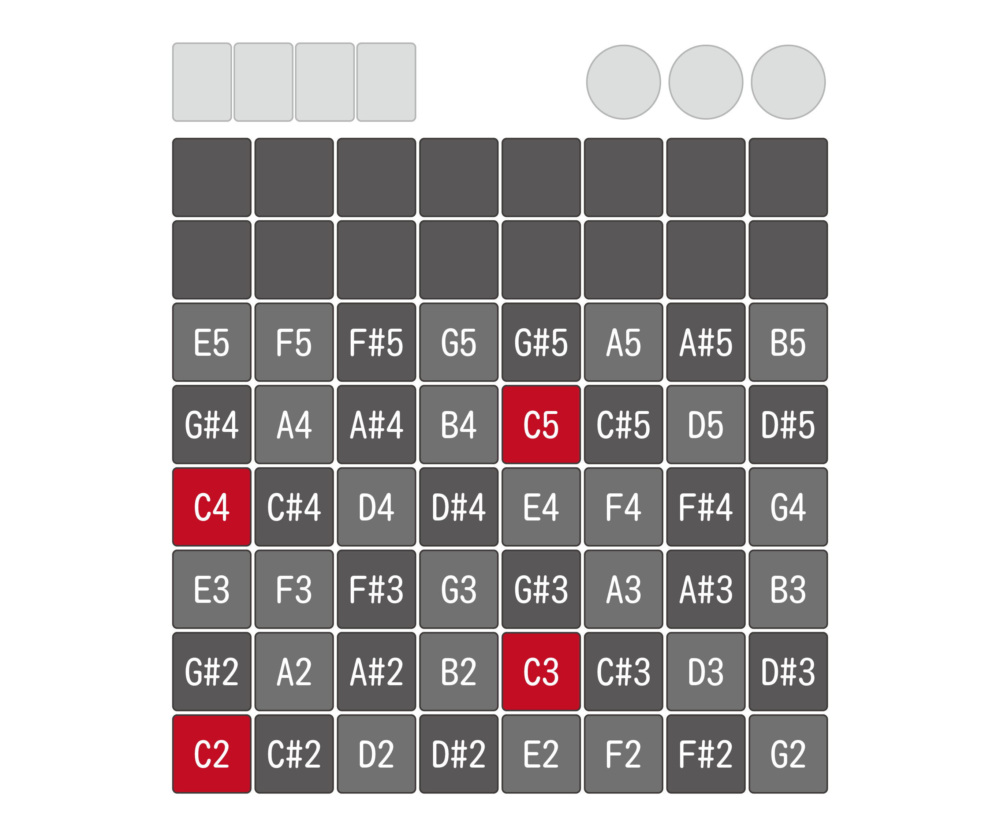
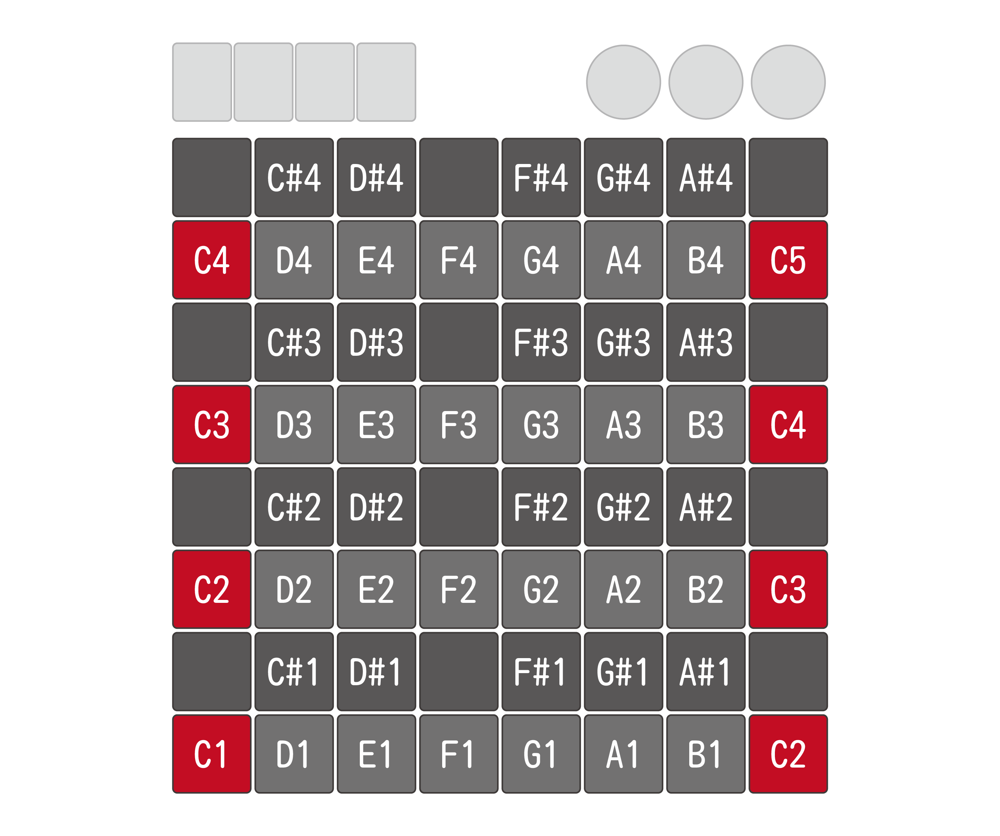
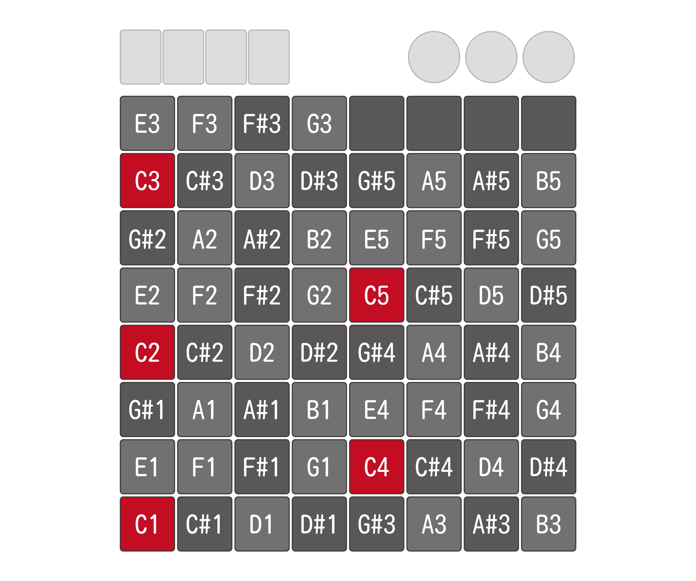
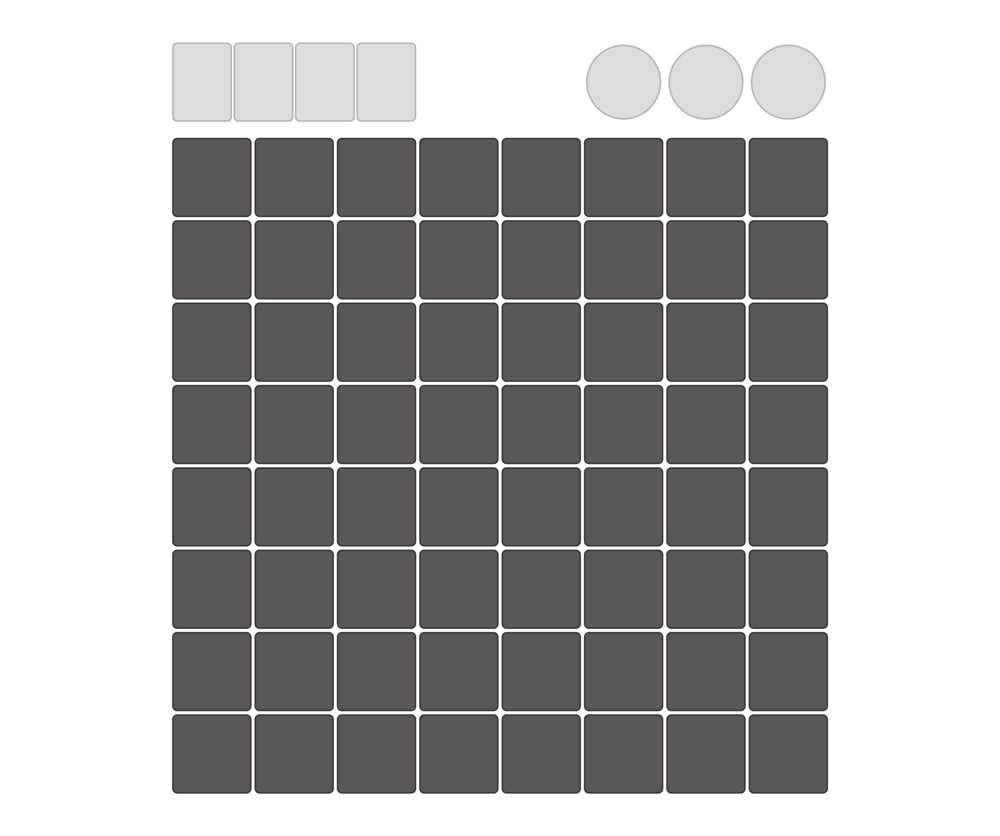

# Feuille64 デフォルトファームウェア マニュアル
## 上部コントロール

### ① チャンネル1
　チャンネル1に切り替わります。
起動時にはレイヤー1が設定されています。

### ② チャンネル2
　チャンネル2に切り替わります。
起動時にはレイヤー6が設定されています。

### ③ チャンネル3
　チャンネル3に切り替わります。
起動時にはレイヤー7が設定されています。

### ④ コンフィグ
　コンフィグモードに切り替わります。

### ⑤ オクターブ
　左回転で1オクターブ下がり、右回転で1オクターブ上がります。

### ⑥ ベロシティ
　左回転でベロシティが下がり、右回転でベロシティが上がります。

### ⑦ システム音量
　左回転でシステム音量が下がり、右回転でシステム音量が上がります。
また、押し込みでLEDのONとOFFを切り替えられます。

## コンフィグモード

左3列で各チャンネルに設定するレイヤーの設定、右上の8キーでLEDの設定を行うことができます。
それぞれのレイヤーのキーマップは後述します。
各チャンネルのレイヤー設定はUSBを抜き差しするとリセットされます。

## レイヤー1

## レイヤー2

## レイヤー3

## レイヤー4

## レイヤー5

## レイヤー6

## レイヤー7

## レイヤー8

